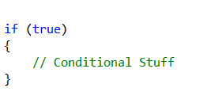
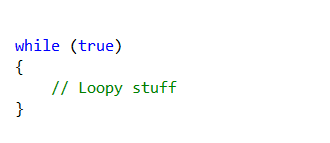
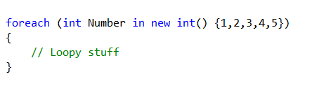
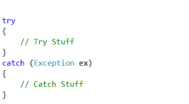
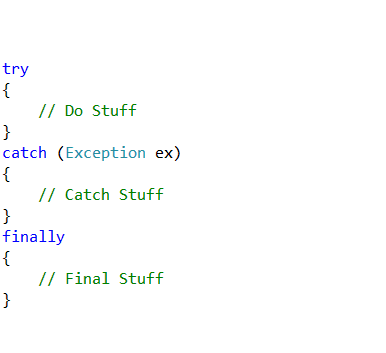

# 'Remove Outer Block' for CodeRush #
This plugin provides a CodeProvider "**Remove Outer Block**" which will remove a block of code and replace it with it's own contents.

Note: This plugin is intended to be used during the process of sculpting code. Since it provides a !CodeProvider and not a Refactoring, it is entirely possible for it to produce uncompilable code. 

### Usage ###
Position your caret on a statement that parents another (If, While, ForEach, Try..Catch etc) and choose the "Remove Outer Block" option from the Code menu. The CodeProvider will then remove the outer block leaving the contained code in it's place.

Note: This CodeProvider will operate on all related siblings of the initial parenting statement, removing all structure but leaving all content. The one exception to this is the *catch* portion of a Try..Catch or Try..Catch..Finally which will be removed in it's entity.

### Examples ###

##### A Simple If Block #####

##### A While Loop #####

##### A For Loop #####

##### A Try Catch Block #####
In this example, see how the catch block content is also removed.

##### A Try Catch Finally Block #####
In this example, see how the catch block content is remove, but the finally block content is retained.

